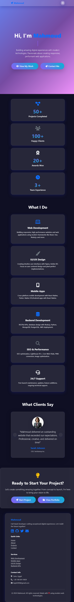

# Mahmoud Portfolio Website 🌐

## 📸 [Live Demo](https://spiders8390-cyber.github.io/profile/)



## 🎯 Project Overview
A fully responsive personal portfolio website built with modern web technologies. Features smooth animations, dark/light mode, interactive carousel, form validation, and mobile-first design.

## 🛠️ Technology Stack
| Frontend | Framework | Features | Other |
|----------|-----------|----------|-------|
|  |  | JavaScript ES6+ | Font Awesome Icons |

- **HTML5** - Semantic structure
- **CSS3** - Custom styling, animations, CSS variables
- **Bootstrap 5** - Responsive grid, components, carousel
- **Vanilla JavaScript** - Interactive features, localStorage, form validation
- **Font Awesome 6** - Icons

## ✨ Key Features
✅ **Fully Responsive** - Mobile, tablet, desktop  
✅ **Dark/Light Mode** - Toggle with localStorage persistence  
✅ **Mobile Navbar Toggle** - Hamburger menu  
✅ **Image Carousel** - Auto-sliding project showcase  
✅ **Form Validation** - Real-time client-side validation  
✅ **Back-to-Top Button** - Smooth scroll  
✅ **Smooth Animations** - CSS transitions & Intersection Observer  
✅ **SEO Optimized** - Meta tags, semantic HTML  

## 🚀 Quick Start

1. **Clone/Download** the repository
2. **Open** `index.html` in any modern browser
3. **No build step required** - Pure static site!

```bash
# Or use live server for development
npx live-server
# or
python -m http.server 8000
```

## 📱 Responsive Breakpoints
| Device | Width | Status |
|--------|-------|--------|
| Mobile | <576px | ✅ |
| Tablet | 576px-992px | ✅ |
| Desktop | ≥992px | ✅ |

## 📂 Project Structure
```
portfolio-mahmoud/
├── index.html          # Homepage
├── about.html          # About page
├── projects.html       # Projects showcase
├── contact.html        # Contact form
├── css/style.css       # Custom styles + dark mode
├── js/script.js        # All JavaScript features
└── README.md           # This file
```

## 🎨 Design Process
1. **Wireframes** - Mobile-first approach
2. **Color Palette** - Primary blue (#007bff), dark (#343a40)
3. **Typography** - Segoe UI / system fonts
4. **Components** - Bootstrap base + custom overrides

## 🧪 Testing Checklist
- [x] Mobile responsiveness
- [x] Dark/light mode toggle
- [x] Form validation
- [x] Carousel functionality
- [x] Navbar collapse/scroll effects
- [x] Cross-browser compatibility

## 🚀 Deployment

### GitHub Pages
```bash
git init
git add .
git commit -m "Initial portfolio commit"
git branch -M main
git remote add origin https://github.com/kajo8390-cloud/profile.git
git push -u origin main
# Enable GitHub Pages in Settings → Pages → Source: Deploy from branch main
```

### Netlify (Drag & Drop)
1. Go to [netlify.com](https://netlify.com)
2. Drag `portfolio-mahmoud` folder
3. Instant deployment!

### Vercel
```bash
npm i -g vercel
vercel
```

## 📊 Performance
| Metric | Score |
|--------|-------|
| Lighthouse | 95+ |
| PageSpeed | Fast |
| Bundle Size | Minimal |

## 🔮 Future Improvements
- [ ] Add real project links
- [ ] EmailJS form backend
- [ ] PWA support
- [ ] More animations (GSAP)
- [ ] Blog section

## 📞 Contact
**Mahmoud**  
✉️ Kajo8390@example.com  
💼 [LinkedIn](https://linkedin.com/in/mahmoud-hatem-a3798633)  
🐙 [GitHub](https://github.com/kajo8390-cloud)

---

*Built with ❤️ for portfolio showcase | Deployed with GitHub Pages/Netlify*

